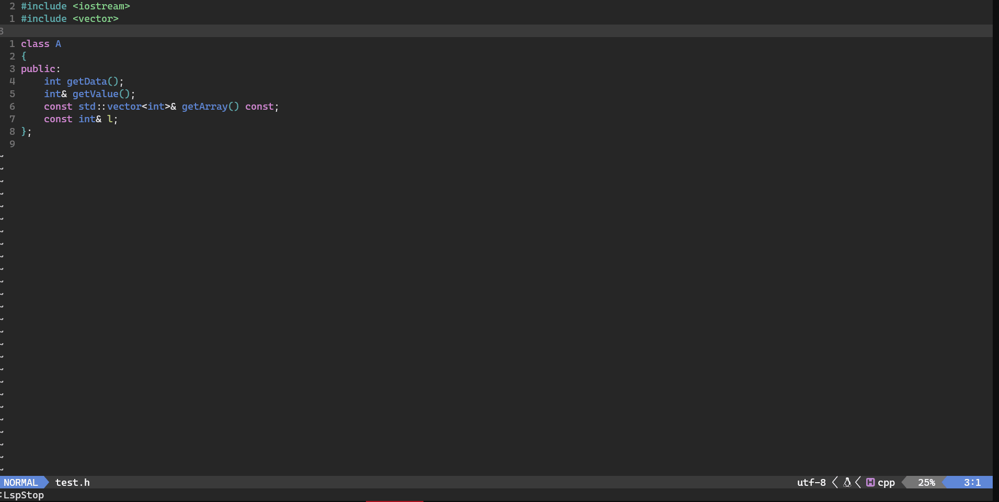
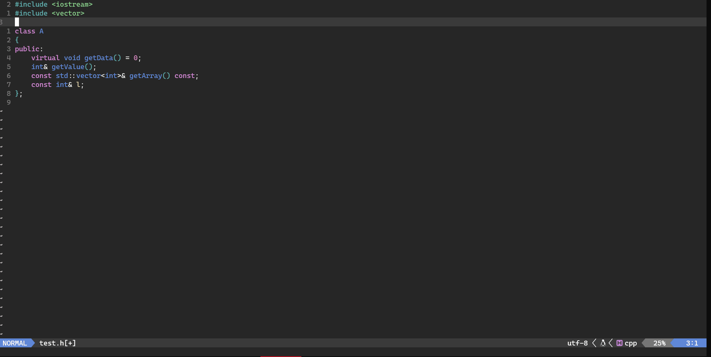
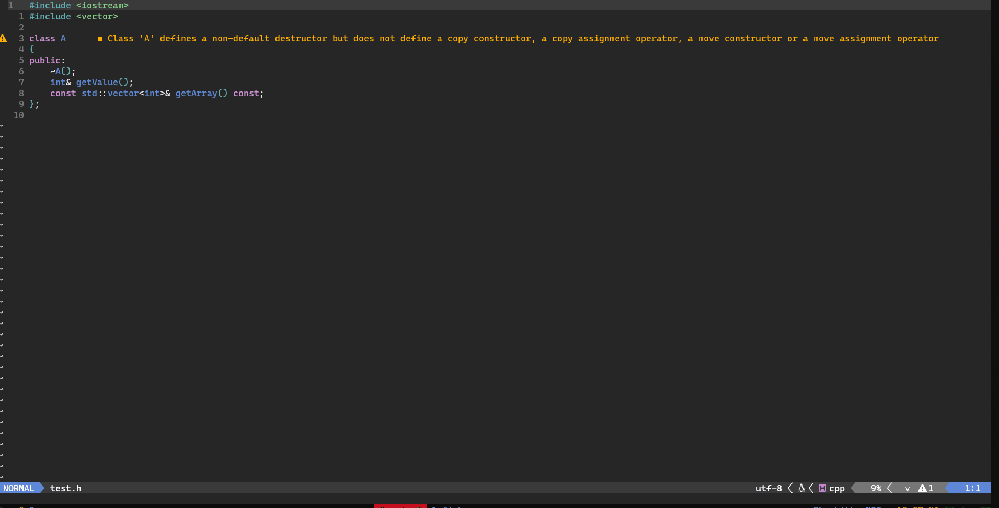

# nt-cpp-tools
Experimental treesitter based neovim plugin to create intelligent implementations for C++

## Features

1. Out-of class member function implementation
2. Concrete class implement from Abstract class or Interface
3. Add missing functions to obey Rule of 3
4. Add missing functions to obey Rule of 5

## Install

Using [paq](https://github.com/savq/paq-nvim)

```
require "paq" {
    "nvim-treesitter/nvim-treesitter",
    "Badhi/nvim-treesitter-cpp-tools",
}
```
## Setup

Append the following config to the nvim-treesitter config

```
nt_cpp_tools = {
      enable = true,
      preview = {
          quit = 'q', -- optional keymapping for quit preview
          accept = '<tab>' -- optional keymapping for accept preview
      },
}
```

## Usage

* Select the range of the class using visual mode
* Use below commands

| Command      | Feature |
| ----------- | ----------- |
| `TSCppDefineClassFunc`      | Implement out of class member functions<br> *subset of functions can be implemented by selecting required function declarations using visual mode or simply keeping the cursor on the function declaration before calling the command*   |
| `TSCppMakeConcreteClass`   | Create a concrete class implementing all the pure virtual functions        |
| `TSCppRuleOf3`   | Adds the missing function declarations to the class to obey the Rule of 3 (if eligible)        |
| `TSCppRuleOf5`   | Adds the missing function declarations to the class to obey the Rule of 5 (if eligible)        |


## Example

1. `TSCppDefineClassFunc`



3. `TSCppMakeConcreteClass`



5. `TSCppRuleOf3`


